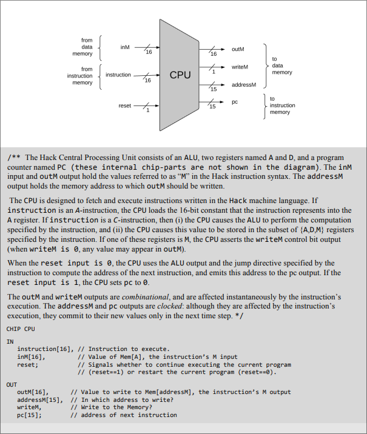
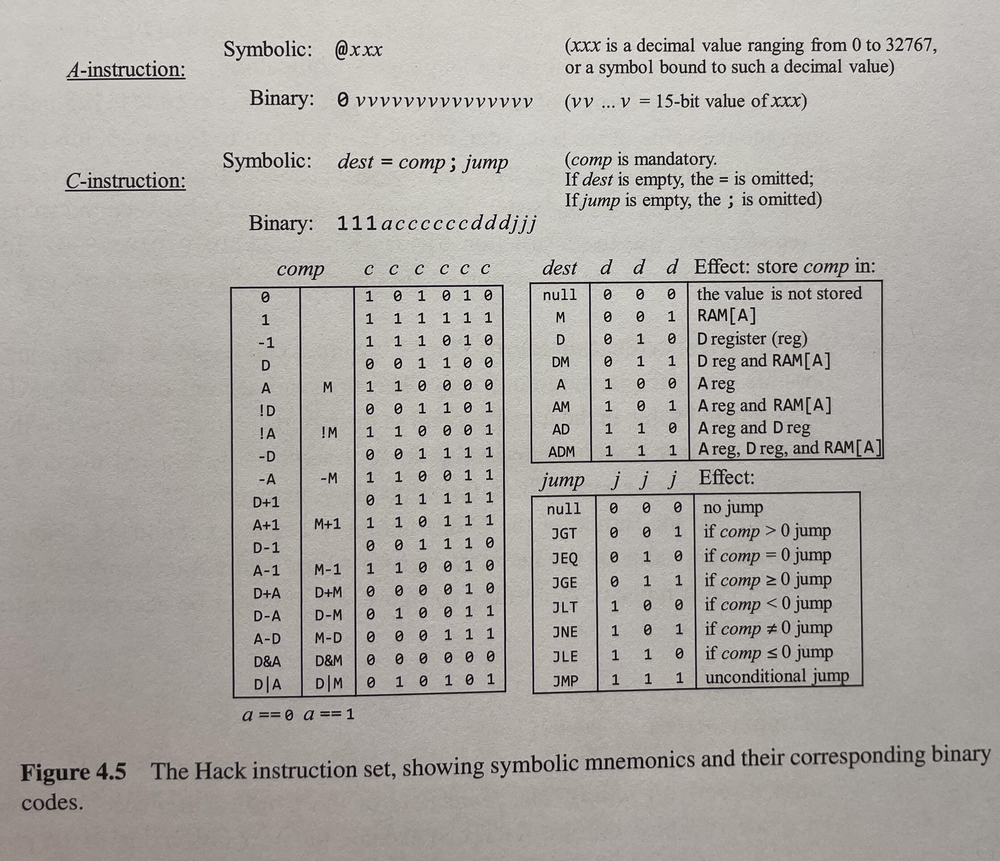

# 16-Bit Verilog CPU


A modular, single-cycle 16-bit RISC processor implemented in Verilog HDL, based off the Hack architecture. This project demonstrates the fundamental principles of computer architecture, including instruction decoding, ALU operations, and memory management.



## 📌 Features
- **16-bit Data Path:** Processes data in 16-bit widths.
- **Instruction Set Architecture (ISA):** HACK architecture, ISA supporting Arithmetic, Logic, and Control Flow instructions.
- **Modular Design:** Separate modules for ALU, Control Unit, Register File, and Program Counter.
- **Memory Mapping:** Supports [Harvard/Von Neumann] architecture with integrated Instruction and Data memory.
- **Simulation Ready:** Includes testbenches for verifying each module and the full system.

## Architecture Overview
The CPU follows a [Single-Cycle / Pipelined] architecture.

### Key Components:
1. **Program Counter (PC):** Handles the address of the next instruction.
2. **Instruction Memory:** Stores the program binary (16-bit instructions).
3. **Register File:** Contains 2 general-purpose 16-bit registers (A and D).
4. **ALU (Arithmetic Logic Unit):** Performs operations like `ADD`, `SUB`, `AND`, `OR`, `XOR`, and `SHIFTS`.
5. **Control Unit:** Decodes opcodes and generates control signals for the datapath.
6. **Data Memory:** 16-bit addressable RAM for load/store operations.

---

## 📜 Instruction Set Architecture (ISA)
Each instruction is 16 bits wide. Below is the encoding format:



---

## Getting Started

### Prerequisites
- **Simulation:** [Icarus Verilog](http://iverilog.icarus.com/) or **Vivado** / **ModelSim**.
- **Waveform Viewer:** [GTKWave](http://gtkwave.sourceforge.net/).

### Running the Simulation
1. **Clone the repo:**
   ```bash
   git clone https://github.com/Parzival129/16-Bit-Verilog-CPU.git
   cd 16-Bit-Verilog-CPU

2. **Compile and test top module with vsim script**

```bash
vsim ../tb/top_module_tb.v
```
or for testing any other module with a testbenchh
```bash
vsim ../tb/[testbench file]
```

---


## 🗺️ Roadmap

* [ ] Implement a 3-stage pipeline to increase clock frequency.
* [ ] Add support for hardware interrupts.
* [ ] Expand the ISA to include floating-point operations.
* [ ] Deploy on a physical FPGA (e.g., Basys 3 or DE10-Lite).

## 🤝 Contributing

Contributions are welcome! Please open an issue or submit a pull request for any improvements or bug fixes.

## 📄 License

This project is licensed under the MIT License - see the [LICENSE](https://www.google.com/search?q=LICENSE) file for details.
